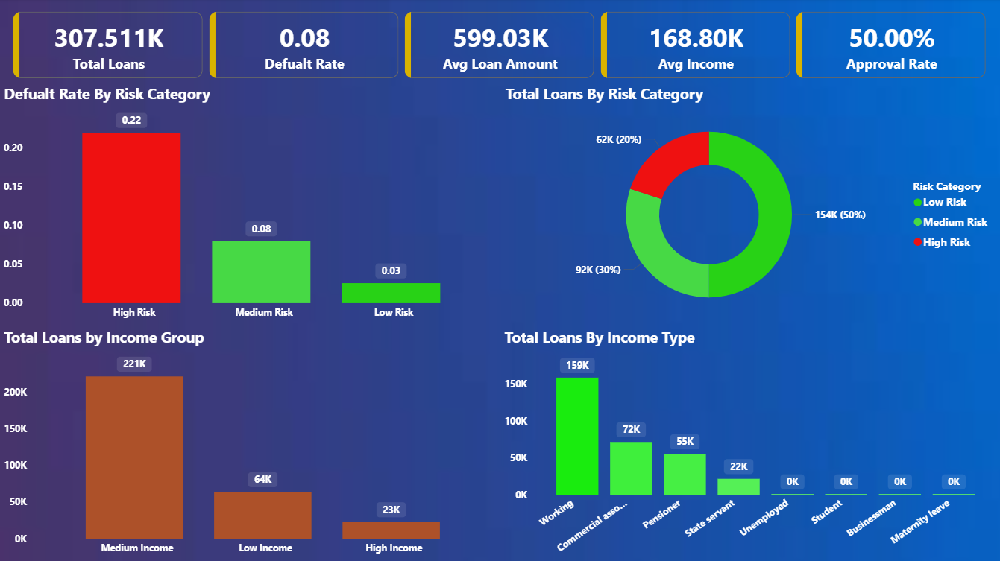
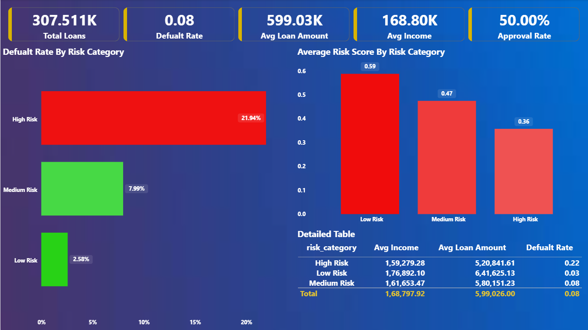
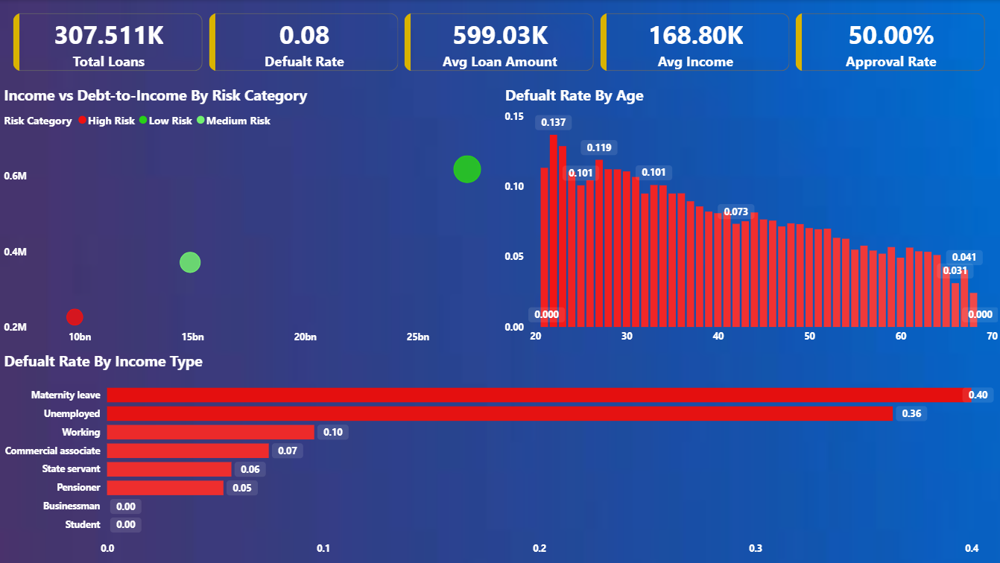
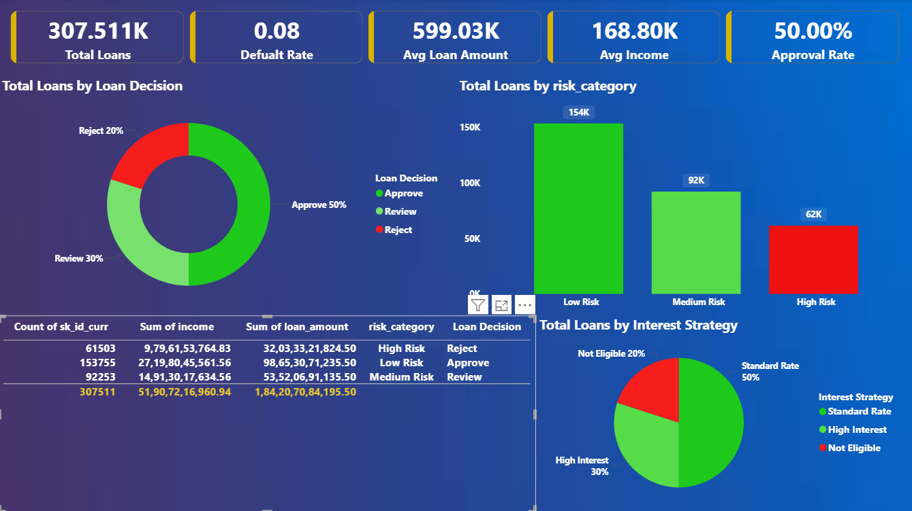

# Credit Risk Scoring System (Fintech Project)

## Overview

This project simulates a **real-world fintech credit risk system** used by digital lending companies to decide whether to approve or reject loan applications.

The system uses:

* PostgreSQL for data engineering
* SQL for feature engineering
* Python for machine learning
* Power BI for business dashboards

---

## Business Problem

In digital lending, approving the wrong customer leads to **loan defaults and financial loss**, while rejecting good customers reduces revenue.

This project solves:

* Who should be approved or rejected?
* How to reduce default risk?
* How to optimize approval strategy?

---

## KPIs Tracked

* Default Rate
* Approval Rate
* Average Loan Amount
* Risk Distribution (Low / Medium / High)

---

## Dataset

Dataset used:
https://www.kaggle.com/competitions/home-credit-default-risk/data

Primary file:

* `application_train.csv`

* ~300K rows

* 120+ features

* Target column: `TARGET` (0 = No Default, 1 = Default)

---

## Architecture (Real Fintech Flow)

RAW DATA → PostgreSQL → SQL Transformations → Feature Table → ML Model → Predictions → Dashboard

---

## Data Engineering (PostgreSQL)

### Raw Table

```sql
CREATE TABLE application_raw (
    sk_id_curr BIGINT,
    target INT,
    amt_income_total NUMERIC,
    amt_credit NUMERIC,
    amt_annuity NUMERIC,
    days_birth INT,
    days_employed INT,
    ext_source_1 NUMERIC,
    ext_source_2 NUMERIC,
    ext_source_3 NUMERIC
);
```

---

### Clean Table

```sql
CREATE TABLE application_clean AS
SELECT
    sk_id_curr,
    target,
    ABS(days_birth)/365 AS age,
    CASE WHEN days_employed > 0 THEN NULL ELSE ABS(days_employed) END AS employment_days,
    COALESCE(amt_income_total,0) AS income,
    amt_credit AS loan_amount,
    amt_annuity AS emi,
    COALESCE(ext_source_1,0.5) AS ext1,
    COALESCE(ext_source_2,0.5) AS ext2,
    COALESCE(ext_source_3,0.5) AS ext3
FROM application_raw;
```

---

### Feature Engineering

```sql
CREATE TABLE loan_features AS
SELECT *,
    loan_amount / NULLIF(income,0) AS debt_to_income,
    emi / NULLIF(income,0) AS emi_to_income,
    (ext1+ext2+ext3)/3 AS avg_risk_score
FROM application_clean;
```

---

## Machine Learning (Python) (View In Jupyter File)

---

## Dashboard Features (Power BI)

* KPI Cards (Total Loans, Default Rate, Avg Loan)
* Risk Distribution (Donut Chart)
* Default Rate by Risk (Bar Chart)
* Income vs Debt-to-Income (Scatter Plot)
* Loan Decision System (Approve / Reject / Review)

---

## Dashboard Preview

### Executive Overview


### Risk Analysis


### Customer Insights


### Loan Decision View


---

## Key Insights

* High **debt-to-income ratio** → higher default risk
* Low **external risk score** → higher probability of default
* Medium-risk users can be approved with higher interest

---

## What Makes This Project Strong

* SQL-first data pipeline
* Real fintech architecture
* ML integrated with database
* Business decision system
* Interactive Power BI dashboard

---

## Future Improvements

* Real-time scoring API (Flask)
* Model monitoring (data drift)
* Advanced models (XGBoost)

---

## Author

**Prajwal Sonekar**
Aspiring Data Analyst | Fintech Analytics

---
